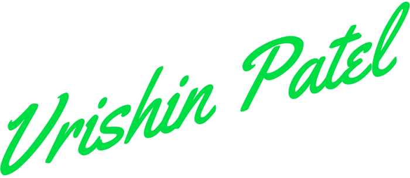

<p align="center">
      
</p>

<br /><br />

<p align="center">
      I am a fullstack developer currently exploring what I think will change the future of technology!
</p>

```js
      import { useMood } from 'mood'

      const [ currentMood, updateMood ] = useMood('Happy :)')

      export const aboutMe = {
            name: 'Vrishin Patel',
            codeName: 'vrishtrix',      // shh, this is a secret!
            languages: ['Javascript/Typescript', 'Python', 'Crystal'],
            organization: '@ForetagInc'
      }
```


<br /><br />

<p align="center">
      <i> You can reach me at: </i>
      <br />
      <a href="mailto:vrishin_patel@outlook.com">
            vrishin_patel@outlook.com
      </a>
</p>

<p align="center">
      <a href="https://www.linkedin.com/in/vrishin-patel">
            
      </a>
      &nbsp; &nbsp;
      <a href="https://www.instagram.com/vrishtrix/">
            
      </a>
      &nbsp; &nbsp;
      <a href="https://discord.bio/p/vrishtrix">
            
      </a>
</p>

<p align="center">
      <i> Looking forward to hearing from you! </i>
</p>

<p align="center">
      
</p>